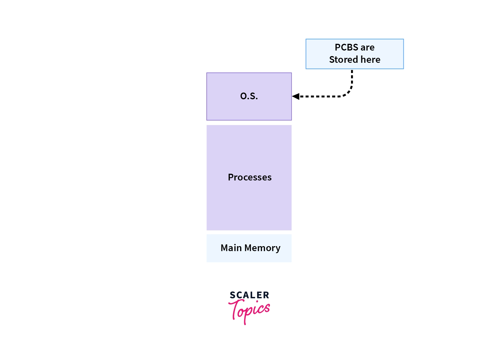

# Process 101 and more
## What is a Process?
A process is an instance of a computer program that is being executed. It contains the program code and its activity.

An application is a program that we can run on our system.
> - When we install an application, it is installed as a file on our system.
> - When we run the application, the operating system loads the application into memory and runs it.

If we run multiple applications, the operating system creates multiple processes for the applications.
> Each process has its own memory space and is isolated from other processes. 

This is known as process isolation.

### _Types of Processes_

There are two types of processes:
- I/O bound process: A process that spends more time doing I/O than computations.
    > Example:
    > - A process that reads data from a file, spends most of its time waiting for data to be read, does some computations on it, and writes the results to another file.
- CPU bound process: A process that spends more time doing computations than I/O.
    > Example:
    > - A process that performs matrix multiplication, sorts a large file, etc.

### *Process States*
A process can be in one of the following states:
- **New:** The process is being created.
- **Ready:** The process is waiting to be assigned to a processor.
- **Running:** Instructions are being executed.
- **Waiting:** The process is waiting for some event to occur(such as an I/O completion or reception of a signal).
- **Terminated:** The process has finished execution.

### What is PCB?
When the process is created by the operating system, it creates a data structure to store the information of that process.

This is known as Process Control Block (PCB).

> #### PCB is a data structure that stores information of a process such as process id, process state, process priority, etc.
> 

- It is the job of the OS to assign a CPU to a process.

- The role of the process control block arises as an identification card for each process.
>   - The Operating System doesn't know which process is which, until Operating System refers through the PCB of every process.

- The process control block contains many attributes such as
   > - **Process ID**
   > - **Process state** 
   > - **Process priority** 
   > - **List of open files, open ports, etc.**
   > - **Memory management information** (memory units & addresses allocated to the process, to the stack, etc.)
   > - **Accounting information** (CPU used, time limits, etc.)
   > - **Copy of program counter & other CPU registers etc. for each process.**

### *What is a CPU Burst?*

A CPU burst is the time during which the process uses the CPU.

## CPU (Process) Scheduling
> The process scheduler selects an available process for program execution on the CPU based on scheduling algorithms.
> The process scheduler is a part of the operating system that decides which process runs at a certain point in time.

### *CPU (Process) Scheduling Algorithms*

There are many scheduling algorithms. Few of them are:
   1. *First Come First Serve (FCFS):* The process that requests the CPU first is allocated the CPU first.
        > - Advantages:
         >   - Simple to implement.
         >   - No starvation.
        > - Disadvantages:
         >   - Average waiting time is high.
         >   - Average turnaround time is high.
         >   - Average response time is high.

   2. *Shortest Job First (SJF):* The process with the shortest burst time is allocated the CPU first.
        > - Advantages:
         >   - Average waiting time is low.
         >   - Average turnaround time is low.
         >   - Average response time is low.
        > - Disadvantages:
         >   - Difficult to implement.
         >   - Starvation is possible.

   3. *Shortest Remaining Time First (SRTF):* The process with the shortest remaining time is allocated the CPU first.
        > - Advantages:
         >   - Average waiting time is low.
         >   - Average turnaround time is low.
         >   - Average response time is low.
        > - Disadvantages:
         >   - Difficult to implement.
         >   - Starvation is possible.

   4. *Priority Scheduling:* The process with the highest priority is allocated the CPU first.
        > - Advantages:
         >   - Average waiting time is low.
         >   - Average turnaround time is low.
         >   - Average response time is low.
        > - Disadvantages:
         >   - Difficult to implement.
         >   - Starvation is possible.

   5. *Round Robin Scheduling:* Each process is allocated the CPU for a fixed time slice.
        > - Advantages:
         >   - Average waiting time is low.
         >   - Average turnaround time is low.
         >   - Average response time is low.
        > - Disadvantages:
         >   - Context switching overhead.
         >   - Average waiting time is high if the time slice is too large.
         >   - Average turnaround time is high if the time slice is too large.
         >   - Average response time is high if the time slice is too large.

   6. *Multilevel Queue Scheduling*: The ready queue is divided into multiple queues based on priority.
        > - Advantages:
         >   - Average waiting time is low.
         >   - Average turnaround time is low.
         >   - Average response time is low.
        > - Disadvantages:
         >   - Difficult to implement.
         >   - Starvation is possible.

   7. *Multilevel Feedback Queue Scheduling*: The ready queue is divided into multiple queues based on priority. A process can move between the queues.
        > - Advantages:
         >   - Average waiting time is low.
         >   - Average turnaround time is low.
         >   - Average response time is low.
        > - Disadvantages:
         >   - Difficult to implement.
         >   - Starvation is possible.

   9. *Lottery Scheduling*: Each process is assigned a number of lottery tickets. The scheduler draws a random ticket to select a process.
        > - Advantages:
         >   - Average waiting time is low.
         >   - Average turnaround time is low.
         >   - Average response time is low.
        > - Disadvantages:
         >   - Difficult to implement.
         >   - Starvation is possible.

   10. *Fair Share Scheduling*: The CPU is allocated to each process based on its share of the CPU.
        > - Advantages:
         >   - Average waiting time is low.
         >   - Average turnaround time is low.
         >   - Average response time is low.
        > - Disadvantages:
         >   - Difficult to implement.
         >   - Starvation is possible.